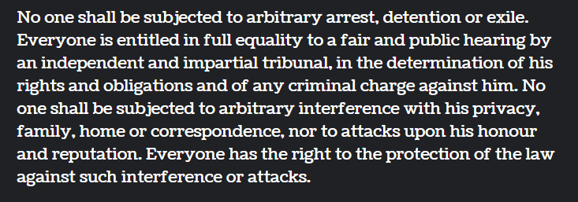

# Text Recognition Project

This project is designed to recognize and process text from images using OpenCV and related libraries. The notebook performs image pre-processing, thresholding, dilation, and segmentation to extract individual lines and words from a given image.

Requirements
To run the code in this notebook, you will need the following libraries:

numpy
pandas
opencv-python
matplotlib
You can install these dependencies using pip:

bash
Copy code
pip install numpy pandas opencv-python matplotlib
Notebook Content
Image Pre-processing
The notebook starts by loading and processing an image called Sample.png. The image is read using OpenCV and converted from BGR to RGB format. If the image width exceeds 1000 pixels, it is scaled down to 1000 pixels while maintaining the aspect ratio.

Thresholding
A thresholding function is defined to convert the image to grayscale and then apply a binary threshold to remove the background. This helps in distinguishing the text from the background.

Dilation
Dilation is applied to the thresholded image to connect components and facilitate contour detection. This step helps in merging the characters into lines or words.

Line Segmentation
Contours are detected in the dilated image to segment it into lines. Each detected line is highlighted with a rectangle. This helps in isolating different lines of text for further processing.

Word Segmentation
Further dilation is applied to the lines to segment them into individual words. Each detected word is then extracted and stored in a list. This step is crucial for breaking down the text into manageable units for recognition.

Display Extracted Words
Finally, the first five extracted words are displayed. This provides a visual check to ensure that the segmentation has been performed correctly.

Conclusion
This notebook provides a step-by-step guide to segmenting and extracting words from an image of text. It is a foundational start for developing a comprehensive system for recognizing text. In the future, this work could be further improved to identify and segment mathematical equations.


## Installation

Install my-project with npm

``` python
pip install numpy pandas opencv-python matplotlib 
```
    
## Screenshots
Sample Image used:


Segmented Image:


